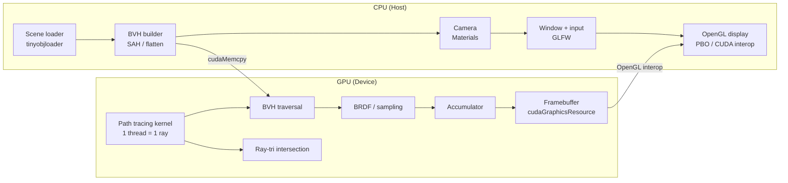

# PathTracer

A GPU-accelerated path tracer built with **CUDA** and **OpenGL**, developed as part of the 42 school curriculum.

---

## Features

- **Path tracing** on GPU via CUDA kernels
- **Progressive accumulation** — each frame averages with previous ones for noise reduction
- **Multi-bounce** ray tracing with cosine-weighted hemisphere sampling
- **Russian roulette** path termination
- **BVH** (Bounding Volume Hierarchy) for fast ray-triangle intersection
- **Texture support** via `cudaTextureObject_t` and UV interpolation
- **Emissive materials**
- **Directional lights** and **spot lights**
- **Real-time camera** movement
- **ImGui** interface to load objects and manage lights at runtime
- **OpenGL display** via PBO (Pixel Buffer Object)

---

## Dependencies

| Library | Role |
|---|---|
| CUDA 13.1 | GPU compute |
| OpenGL / GLAD | Display |
| GLFW | Window and input |
| GLEW | OpenGL extension loading |
| GLM | Math (vectors, matrices) |
| ImGui | UI |
| ImGuiFileDialog | File picker in UI |
| tinyobjloader | `.obj` file parsing |
| stb_image | Texture loading |

---

## Project Structure

```
.
├── assets/             # Scene files (.obj, .mtl, textures)
├── includes/           # All headers
│   ├── ImGui/          # ImGui backend headers
│   ├── glad/           # OpenGL loader
│   └── ...
├── shaders/            # GLSL shaders (vertex + fragment)
├── srcs/
│   ├── app/            # Application and Camera
│   ├── cuda/           # CUDA kernel and Compute class
│   ├── ImGui/          # ImGui sources and UI layer
│   ├── render/         # OpenGL renderer
│   ├── scene/          # Scene, SceneObject, BVH
│   ├── glad.c
│   └── main.cpp
└── Makefile
```

---

## Build & Run

### Requirements

- Linux (tested on Fedora)
- CUDA 13.1
- g++-14
- GLFW, GLEW, OpenGL installed system-wide

### Compile

```bash
make
```

### Run

```bash
make run
```

For systems with hybrid GPU (NVIDIA Optimus), the Makefile automatically sets `__NV_PRIME_RENDER_OFFLOAD=1`.

### Other targets

```bash
make clean    # Remove object files
make fclean   # Remove object files and binary
make re       # Full rebuild
make val      # Run with Valgrind
make help     # Display available targets
```

---

## Usage

1. Launch the application — the window starts empty
2. Press `H` to toggle the ImGui interface
3. Use the **Scene** panel to load a `.obj` file via the file dialog
4. Use the **Lights** panel to add, select, and edit lights in real time
5. Move the camera with keyboard/mouse — accumulation resets automatically on movement

---

## Architecture

### Rendering pipeline

```
Camera → generateRay()
    → BVH traversal (GPU)
        → HitRecord (position, normal, UV, material)
            → Direct lighting (shadow ray per light)
            → Emissive contribution
            → Cosine-weighted bounce
                → Russian roulette termination
accumBuffer[] += finalColor
fb[] = accumBuffer / frameIndex
```

### CPU / GPU split

| Class | Responsibility |
|---|---|
| `SceneObject` | CPU-side mesh data (triangles, materials, texture paths) |
| `Scene` | GPU buffers, global texture pool, BVH, lights |
| `Compute` | Kernel launch, accumulation buffer |
| `Renderer` | OpenGL PBO, texture display |
| `BVH` | SAH-based BVH construction |



## Images


---

## Author

**lde-merc** — 42 school
